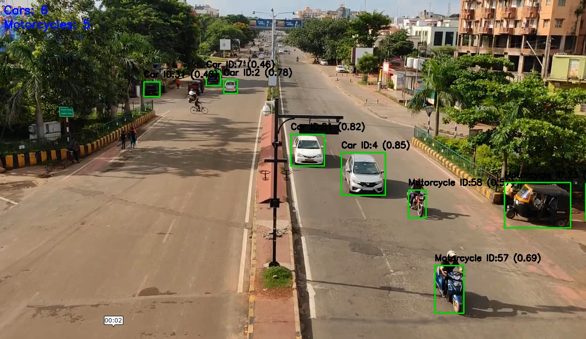

# 🛰️ Object Tracking with YOLOv8 + ByteTrack

This project demonstrates **real-time object tracking** using [YOLOv8](https://github.com/ultralytics/ultralytics) for detection and **ByteTrack** for multi-object tracking. It supports video input and can track vehicles, people, or any YOLO-detected objects across frames.

---

## 📷 Demo



> The image above is a snapshot from the tracking output using a sample video.

---

## 🛠️ Requirements

Install all dependencies with:

```bash
pip install -r requirements.txt
